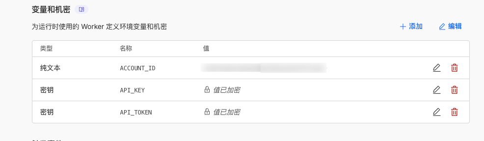
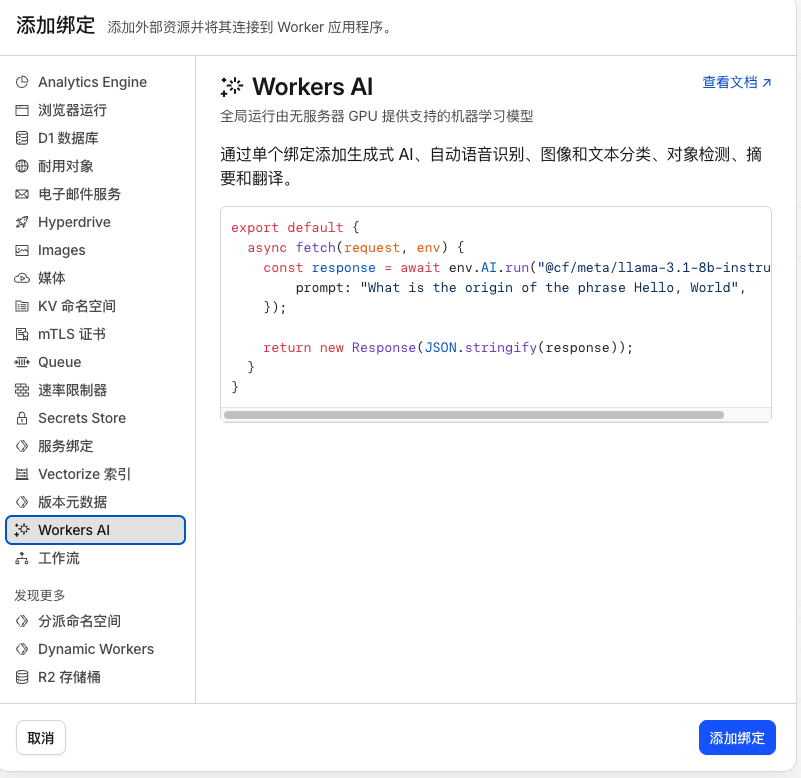
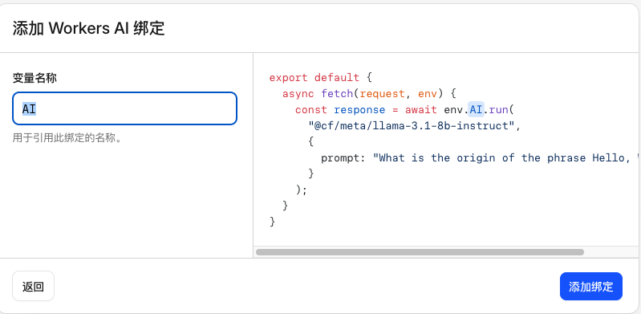

# Cloudflare Workers AI → OpenAI API 适配器

将 [Cloudflare Workers AI](https://developers.cloudflare.com/workers-ai/) 转换为兼容 OpenAI Chat Completion 格式的 API 代理，让你可以在任何支持 OpenAI API 的客户端中直接使用 Cloudflare 的免费 AI 模型。

> 灵感来自于项目（[workersAI-convert-chatCompletions-API](https://github.com/juerson/workersAI-convert-chatCompletions-API)）

## ✨ 特性

- 🔄 **完全兼容 OpenAI 格式** — 支持 `/v1/chat/completions` 和 `/v1/models` 端点
- 🌊 **流式 & 非流式** — 自动支持 `stream: true/false`，由客户端控制
- 🎯 **模型短名称映射** — 使用简短名称（如 `llama-3.1-8b-instruct`）自动映射到 Cloudflare 完整路径
- 🔑 **自定义 API Key** — 设置自己的鉴权密钥，保护接口安全
- 🔀 **多账号负载均衡** — 支持配置多个 Cloudflare 账号，随机切换使用
- ☁️ **零成本部署** — 利用 Cloudflare Workers 免费额度运行

## 📦 部署指南

### 前置条件

1. 一个 [Cloudflare 账号](https://dash.cloudflare.com/sign-up)
2. 获取你的 **Account ID** 和 **API Token**（需要 Workers AI 读写权限）

> **获取方式**：登录 Cloudflare Dashboard → Workers AI → Use REST API → 按提示创建 API Token 并复制 Account ID

### 步骤一：创建 Worker

1. 登录 [Cloudflare Dashboard](https://dash.cloudflare.com/)
2. 进入左侧菜单 **Workers & Pages**
3. 点击 **Create**（创建）
4. 选择 **Create Worker**（创建 Worker）
5. 为 Worker 取一个名称（如 `ai-api-proxy`），点击 **Deploy**（部署）

### 步骤二：粘贴代码

1. 部署后点击 **Edit Code**（编辑代码）
2. 删除默认代码，将 `workers.js` 的全部内容粘贴进去
3. 点击右上角 **Deploy**（部署）

### 步骤三：配置环境变量（推荐）

为了安全起见，**强烈建议**通过环境变量配置敏感信息，而不是硬编码在代码中：

1. 进入 Worker 的 **Settings**（设置）→ **Variables and Secrets**（变量和密钥）
2. 添加以下变量：

| 变量名       | 类型 | 说明                                          |
| ------------ | ---- | --------------------------------------------- |
| `ACCOUNT_ID` | 文本 | 你的 Cloudflare Account ID                    |
| `API_TOKEN`  | 密钥 | 你的 Cloudflare API Token                     |
| `API_KEY`    | 密钥 | 自定义的 API 访问密钥（客户端需要使用此密钥） |



> 如果设置了环境变量，会自动覆盖代码中的硬编码值。

### 步骤四：添加 Workers AI 绑定

1. 选择绑定
2. 添加绑定
3. 选择Workers AI，点击添加绑定
4. 变量名称填入：AI，点击添加绑定




### 步骤五：验证部署

部署成功后，你的 API 地址为：

```
https://<你的worker名称>.<你的子域>.workers.dev
```

使用 `curl` 测试：

```bash
# 测试模型列表
curl https://your-worker.your-subdomain.workers.dev/v1/models \
  -H "Authorization: Bearer sk-你的自定义密钥"

# 测试聊天（非流式）
curl https://your-worker.your-subdomain.workers.dev/v1/chat/completions \
  -H "Authorization: Bearer sk-你的自定义密钥" \
  -H "Content-Type: application/json" \
  -d '{
    "model": "llama-3.1-8b-instruct",
    "messages": [{"role": "user", "content": "你好"}]
  }'

# 测试聊天（流式）
curl https://your-worker.your-subdomain.workers.dev/v1/chat/completions \
  -H "Authorization: Bearer sk-你的自定义密钥" \
  -H "Content-Type: application/json" \
  -d '{
    "model": "llama-3.1-8b-instruct",
    "stream": true,
    "messages": [{"role": "user", "content": "你好"}]
  }'
```

## 🔧 客户端配置

### 通用配置

在任何支持 OpenAI API 的客户端中，将以下参数替换为你自己的值：

| 配置项       | 值                                                  |
| ------------ | --------------------------------------------------- |
| API Base URL | `https://your-worker.your-subdomain.workers.dev/v1` |
| API Key      | 你设置的自定义密钥（如 `sk-xxxx`）                  |
| Model        | 模型短名称，如 `llama-3.1-8b-instruct`              |

### Python (OpenAI SDK)

```python
from openai import OpenAI

client = OpenAI(
    api_key="sk-你的自定义密钥",
    base_url="https://your-worker.your-subdomain.workers.dev/v1"
)

# 非流式
response = client.chat.completions.create(
    model="llama-3.1-8b-instruct",
    messages=[{"role": "user", "content": "你好，请介绍一下自己"}]
)
print(response.choices[0].message.content)

# 流式
stream = client.chat.completions.create(
    model="llama-3.1-8b-instruct",
    messages=[{"role": "user", "content": "写一首关于春天的诗"}],
    stream=True
)
for chunk in stream:
    if chunk.choices[0].delta.content:
        print(chunk.choices[0].delta.content, end="")
```

### Node.js (OpenAI SDK)

```javascript
import OpenAI from 'openai';

const openai = new OpenAI({
	apiKey: 'sk-你的自定义密钥',
	baseURL: 'https://your-worker.your-subdomain.workers.dev/v1',
});

const completion = await openai.chat.completions.create({
	model: 'llama-3.1-8b-instruct',
	messages: [{ role: 'user', content: '你好' }],
});

console.log(completion.choices[0].message.content);
```

## 📋 支持的模型

以下为当前配置的模型短名称列表（可在代码中自行增减）：

| 短名称                            | Cloudflare 模型路径                             |
| --------------------------------- | ----------------------------------------------- |
| `llama-3.1-8b-instruct`           | @cf/meta/llama-3.1-8b-instruct                  |
| `llama-3.3-70b-instruct-fp8-fast` | @cf/meta/llama-3.3-70b-instruct-fp8-fast        |
| `llama-4-scout-17b-16e-instruct`  | @cf/meta/llama-4-scout-17b-16e-instruct         |
| `deepseek-r1-distill-qwen-32b`    | @cf/deepseek-ai/deepseek-r1-distill-qwen-32b    |
| `gemma-7b-it`                     | @hf/google/gemma-7b-it                          |
| `mistral-7b-instruct-v0.2`        | @hf/mistral/mistral-7b-instruct-v0.2            |
| `kimi-k2.5`                       | @cf/moonshotai/kimi-k2.5                        |
| `kimi-k2.6`                       | @cf/moonshotai/kimi-k2.6                        |
| ...                               | 更多模型请查看代码中的 `TEXT_GENERATION_MODELS` |

> 完整模型列表请参考 [Cloudflare Workers AI Models](https://developers.cloudflare.com/workers-ai/models/)

## 🛠 自定义配置

### 添加新模型

在 `workers.js` 的 `TEXT_GENERATION_MODELS` 对象中添加新的映射：

```javascript
const TEXT_GENERATION_MODELS = {
	// ... 现有模型
	你的短名称: '@cf/provider/model-name',
};
```

### 修改默认模型

修改 `DEFAULT_MODEL` 常量：

```javascript
const DEFAULT_MODEL = 'llama-3.1-8b-instruct'; // 改为你想要的默认模型短名称
```

### 多账号配置

在 `cf_account_array` 中添加多个账号，系统会随机选择使用：

```javascript
let cf_account_array = [
	{ account_id: '账号1_ID', token: '账号1_Token' },
	{ account_id: '账号2_ID', token: '账号2_Token' },
];
```

## ❓ 常见问题

### Q: 返回 401 Unauthorized？

请检查客户端使用的 API Key 是否与 Worker 中配置的 `api_key` 一致。

### Q: 返回模型相关错误？

请确认使用的模型名称在 `TEXT_GENERATION_MODELS` 映射表中存在，或者检查该模型是否仍在 Cloudflare Workers AI 中可用。

### Q: 如何查看日志？

在 Cloudflare Dashboard 中，进入你的 Worker → **Logs**（日志），可以实时查看请求日志和错误信息。

### Q: 有请求限制吗？

受限于 [Cloudflare Workers AI 的免费额度](https://developers.cloudflare.com/workers-ai/platform/pricing/)和 [Workers 的请求限制](https://developers.cloudflare.com/workers/platform/limits/)，请参考官方文档了解具体限额。

## ⚠️ 免责声明

1. **本项目仅供学习和研究用途**，不得用于任何商业或非法目的。使用者应自行承担使用本项目的一切风险和法律责任。

2. **API Key 安全**：请勿将 API Key、Account ID、API Token 等敏感凭证泄露或硬编码在公开仓库中。建议始终使用 Cloudflare Workers 的环境变量 / Secrets 来存储敏感信息。因凭证泄露导致的任何损失由使用者自行承担。

3. **服务可用性**：本项目依赖 Cloudflare Workers AI 服务，不保证服务的持续可用性、稳定性或性能。Cloudflare 可能随时更改其 API 接口、定价策略或服务条款。

4. **模型输出**：AI 模型生成的内容可能存在不准确、有偏见或不当的情况。使用者应对模型输出进行独立审查和验证，不应将其作为专业建议的替代。

5. **合规要求**：使用者有责任确保使用本项目符合所在地区的法律法规，包括但不限于数据隐私保护、内容审查等相关法律要求。

6. **无担保声明**：本项目按"现状"提供，不提供任何形式的明示或暗示担保，包括但不限于适销性、特定用途适用性和非侵权性的担保。

**使用本项目即表示你已阅读并同意以上免责声明。**

## 📄 许可证

MIT License
